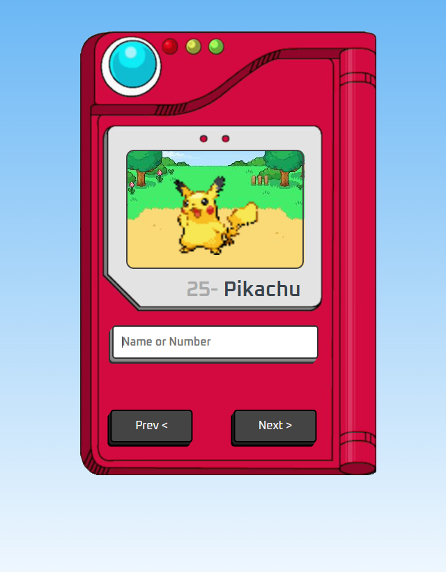

# Pokédex

Este projeto é uma Pokédex desenvolvida com **HTML**, **CSS** e **JavaScript**, consumindo dados da [PokéAPI](https://pokeapi.co/). A ideia foi baseada no vídeo do canal **Manual do Dev**, onde o processo de criação é explicado em detalhes.

## 🎮 Funcionalidades

- Buscar informações detalhadas de qualquer Pokémon.
- Exibir nome, número e imagem dos Pokémon.
- Navegar entre diferentes Pokémon utilizando botões de navegação.
  
## 🚀 Tecnologias Utilizadas

- **HTML5**: Estrutura do projeto.
- **CSS3**: Estilização e design.
- **JavaScript**: Lógica de busca e integração com a PokéAPI.
- **PokéAPI**: Fonte de dados dos Pokémon.

## 📦 Como Utilizar

1. Clone o repositório:
   ```bash
   git clone https://github.com/LuaSpecht/Pokedex.git

2. Abra o arquivo index.html em seu navegador de preferência.

3. Explore a Pokédex, pesquisandoo seu Pokémon favorito pelo nome, ID ou navegando entre eles.


## 📄 Inspiração

Este projeto foi inspirado no vídeo [Como criar uma Pokedex com HTML, CSS e JavaScript](https://www.youtube.com/watch?v=SjtdH3dWLa8) do canal **Manual do Dev**. A Pokédex utiliza a [PokéAPI](https://pokeapi.co/) para acessar os dados dos Pokémon.

## 🌐 Acesse o projeto online

Acesse o resultado deste projeto através do link [github.com/LuaSpecht/Pokedex](https://github.com/LuaSpecht/Pokedex)

